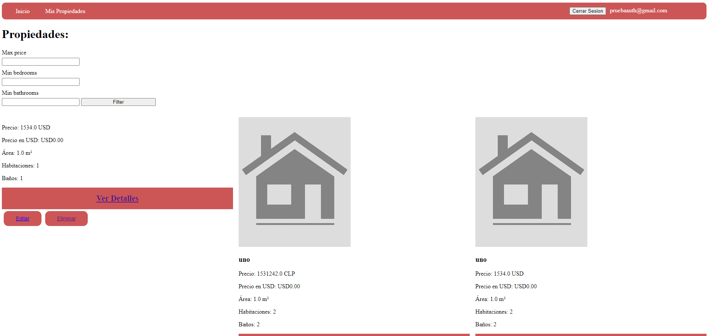

# Portal de Propiedades

## Instrucciones para Levantar el Proyecto

### Requisitos Previos

#### Asegúrate de tener instalados los siguientes requisitos previos:

Ruby (versión 3.1.3 o superior)

Ruby on Rails (versión 7 o superior)

PostgreSQL 14 o 16

### Pasos para Configurar el Proyecto

### Clona el Repositorio:

```bash
git clone https://github.com/admodev/propiedades-app.git
```

```bash
cd propiedades-app
```

#### Instala las Dependencias:

```bash
bundle install
```

#### Configura la Base de Datos:

```bash
rails db:create
```

```bash
rails db:migrate
```

#### Inicia el Servidor:

```bash
rails server
```

| El servidor estará disponible en http://localhost:3000.

#### Diagrama de Relacion de Entidades (ER)

A continuación, se presenta el diagrama ER que representa las relaciones entre las entidades (Models) del proyecto:

```text
+---------------------+      +-----------------+      +-------------------+
|      Users          |      |   Properties    |      |      Photos       |
+---------------------+      +-----------------+      +-------------------+
| id                  |      | id              |      | id                |
| email               |      | type            |      | image             |
| encrypted_password  |      | price           |      | property_id       |
|                     |      | currency        |      +-------------------+
+---------------------+      | commune         |
                             | address         |
                             | area            |
                             | bedrooms        |
                             | bathrooms       |
                             | description     |
                             | user_id         |
                             +-----------------+
```

```text
----------------------------------------------------------------------------------
```

### Notas Adicionales

Seeding: Si deseas cargar datos de ejemplo, puedes ejecutar:

```bash
rails db:seed
```

Integración con API Mindicador.cl: El proyecto ya está configurado para integrarse con la API de Mindicador.cl para obtener el valor del dólar. Asegúrate de que tu aplicación tenga acceso a internet para realizar estas requests.

Credenciales: Asegúrate de configurar las credenciales de la base de datos en config/database.yml y de tener las variables de entorno necesarias (por ejemplo, las claves API) configuradas.

Habiendo hecho todo esto, tendras disponible el entorno, saludos!

